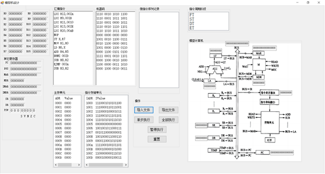
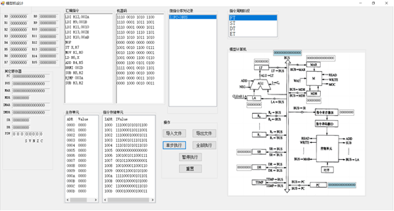
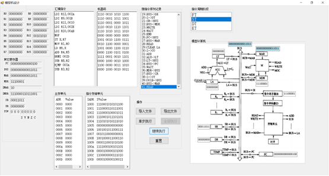
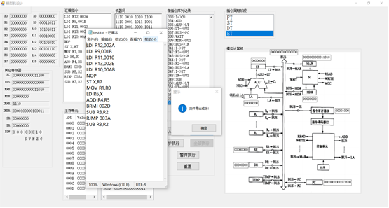

## 项目简介

本项目是一个基于**C#**和**Windows Forms**框架开发的简单CPU模拟器。作为华北理工计科计算机组成原理课程大作业，通过图形化界面（GUI），完整地、可视化地展示了一段汇编程序从转码、取指、译码到最终执行的全过程。

模拟器旨在帮助学习者直观地理解CPU内部的复杂工作流，例如指令如何被分解为微指令序列、数据如何在寄存器、总线和内存之间流动，以及程序计数器（PC）如何控制程序的执行顺序。用户可以导入预设的汇编代码，并选择**单步执行**或**自动连续执行**来观察每一个时钟周期内模型机各个部件的状态变化。

如果对您**有帮助**，欢迎**star**⭐或**fork**。

## 核心功能

**1.指令导入与转码**: 从 `.data` 文件中读取汇编指令，并自动将其翻译为二进制机器码。



**2.可视化执行流程**:

- 模型机动态显示: 以图形化方式展示CPU核心部件，并在数据传递时**高亮**显示相关总线和寄存器，清晰地展示数据流向。

- 微指令序列: 将每条机器指令分解为详细的微指令序列，并逐条显示。

- 周期阶段显示: 实时展示当前指令正处于**取指、译码、执行、访存、写回**中的哪一个阶段。

**3.灵活的执行控制**:

  - 单步执行: 手动控制，每次点击执行一条微指令，便于仔细分析。



  - 全部执行: 自动连续执行所有指令，并可通过按钮**暂停**和**继续**。



**4.状态监控与导出**:

  - 寄存器实时监控: 界面实时显示所有通用寄存器（R0-R15）、PC、MAR、MDR、IR等的状态值。
    
  - 内存单元查看: 可查看指令存储器和数据存储器的内容。
    
  - 数据导出: 程序执行完毕后，可将所有寄存器和内存单元的最终状态导出为 `.txt` 文件，方便分析和验证。



## 模拟器架构

**1.CPU 设计**:

- 采用 **5级流水线** 技术（取指、译码、执行、访存、写回）。

- 拥有 **16个8位通用寄存器** (r0-r15) 和一个16位的 **PC寄存器**。

- 指令存储器和数据存储器分离。

**2.模块划分**:

- 输入指令模块: 负责从文件加载汇编代码。
- 指令转码模块: 将汇编指令转换为**二进制机器码**。
- 模拟执行模块: 核心模块，负责解析机器码，生成并执行**微指令序列**。
- 导出数据模块: 负责在执行结束后，将结果保存到文件。

## 支持的指令集

模拟器实现了以下一个精简但具有代表性的指令集：

| 指令   | 格式         | 功能描述       |
| ------ | ------------ | -------------- |
| `Add`  | `Add Rd, Rr` | 寄存器加法     |
| `Sub`  | `Sub Rd, Rr` | 寄存器减法     |
| `Mov`  | `Mov Rd, Rr` | 数据传送       |
| `Ldi`  | `Ldi Rd, K`  | 载入立即数     |
| `Ld`   | `Ld Rd, X`   | 从内存加载数据 |
| `St`   | `St X, Rr`   | 向内存存储数据 |
| `RJMP` | `RJMP K`     | 无条件相对跳转 |
| `BRMI` | `BRMI K`     | 结果为负则跳转 |
| `Nop`  | `Nop`        | 空操作         |

## 如何运行

#### 一：直接运行 (推荐)

1. 前往本仓库的 **Releases** 页面。
2. 下载最新的 `SimpleCPUSimulator.zip` 压缩包。
3. 解压后，直接运行 `.exe`文件即可。
4. 点击 **“导入文件”** 按钮，选择一个包含汇编指令的 `test.data` 文件。

#### 二：从源码编译

1. 确保你已安装 Visual Studio 和 .NET Framework (建议 4.7.2 或更高版本)。
2. 克隆或下载本仓库源码。
3. 使用 Visual Studio 打开 `.sln` 解决方案文件。
4. 点击 "生成 (Build)" -> "生成解决方案 (Build Solution)"。
5. 生成成功后，直接按 `F5` 或点击 "启动" 按钮运行。

## 项目结构

```
.
├── SimpleCPUSi/      # 源代码文件
├── screenshots/       # 项目截图和gif
├── doc/               # 项目文档
├── .gitignore            # Git忽略配置文件
├── LICENSE             # 开源协议
└── README.md             # 项目说明文件
```
